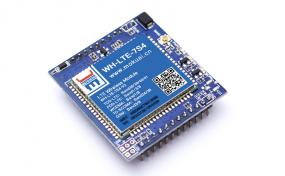
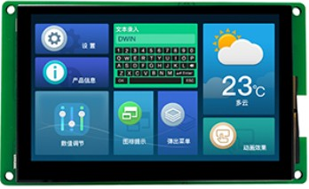
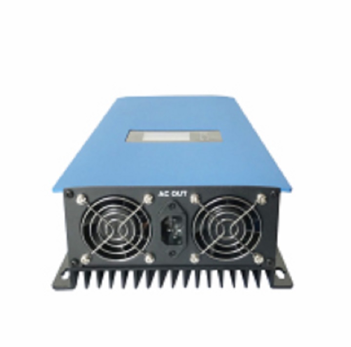
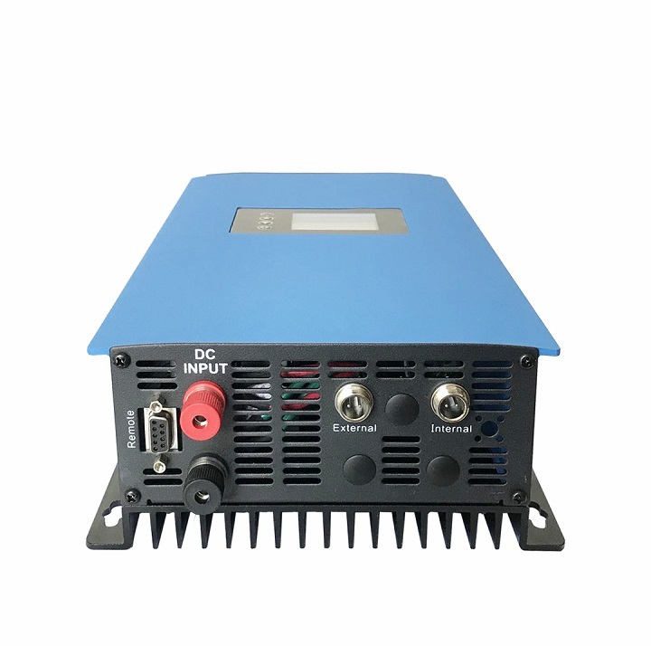

# Nondestructive discharge instrument: 基于STC8的无损放电仪

  
- [Nondestructive discharge instrument: 基于STC8的无损放电仪](#nondestructive-discharge-instrument-基于stc8的无损放电仪)
  - [更新说明](#更新说明)
  - [简介](#简介)
  - [功能](#功能)
  - [使用方式](#使用方式)
  - [关键点](#关键点)
  - [测试项目](#测试项目)
  - [测试说明](#测试说明)
  - [函数说明](#函数说明)
  - [存在问题](#存在问题)

## 更新说明

| Date       | Author | Note          | Version number |
| ---------- | ------ | ------------- | -------------- |
| 2022.09.01 | LHC    | First edition | V1.0.0         |

## 简介

- 无损放电仪主要由 数据交互芯片**STC8**、上云芯片 **WH-LTE-7S4-V2**、迪文屏幕 **DMG80480T043_01W**构成。 
- WH-LTE-7S4-V2:
- 
- DMG80480T043_01W:
  
- 特别说明：
    > 本机加入了独立看们狗功能，永不死机。

## 功能

- 本机器在原有机器：光伏逆变器[SUN-1000G2-M](http://www.suntcn.com/productinfo/300344.html)基础上进行了改进，并加入了物联上云功能，实现了关键参数远程可控。

## 使用方式

- 接入``AC220V``，对机器进行供电。
- 在负载接入端，接入外部电源。
- 原使用手册:
  [原使手册](Document/second-generation-user-manual-of-sun-grid-tie-.pdf)
- 交流输入端:
  
- 直流输入端:
  

## 关键点

- 硬件部分：
  - PCB尺寸过大，且安装孔距与实际严重不符。
  - 通讯线路在大功率模式（Power>``100w``）时，干扰严重，必须接入**抗干扰磁环**。

- 软件部分：
  - 暂略。

## 测试项目

- 参看同目录下[无损换能测试仪测试报告](Document/无损换能测试仪测试报告.docx)。

## 测试说明

- 参看同目录下[无损换能测试仪测试报告](Document/无损换能测试仪测试报告.docx)。

## 函数说明

- 暂略。

## 存在问题

- 软件部分:
  - **参数设置界面**:修改过参数若未保存，第二进入时不会主动回退至原参数。
  - **登录界面**: 用户名输入时，偶尔会出现错误提示。（下层参数界面数据解析实时性不好）。
  - **显示界面**: ``当前放电电流偶尔显示错误``,底层部分变量未初始化。[2022.9.1:已解决]
